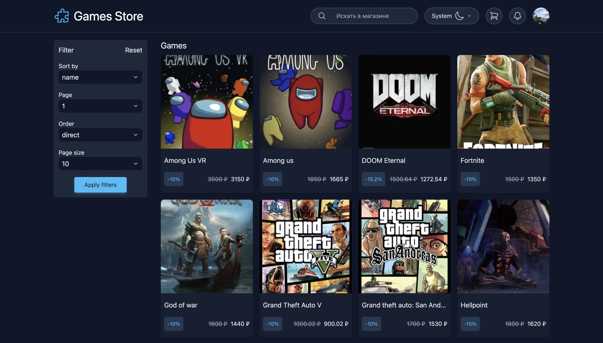
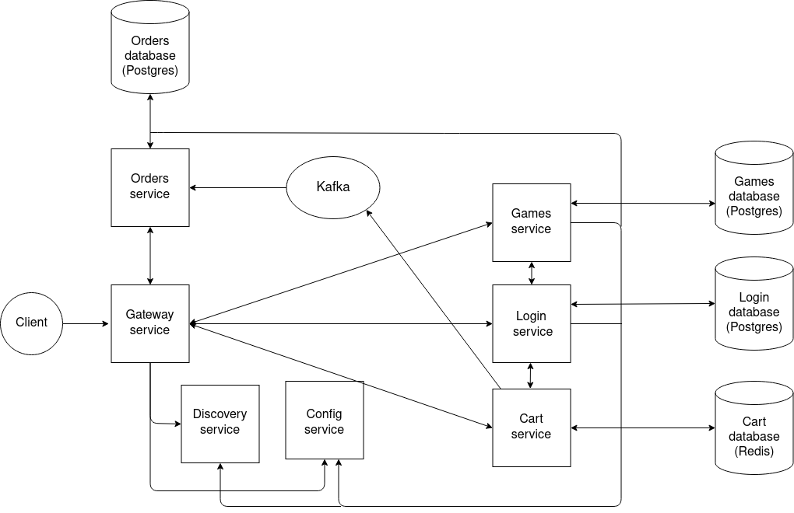
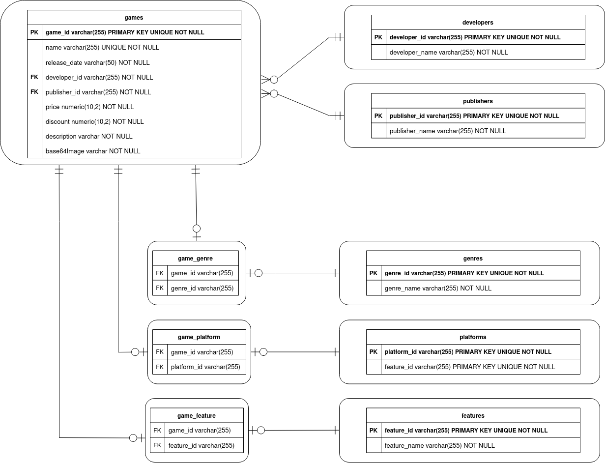
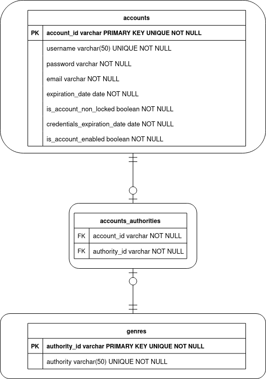
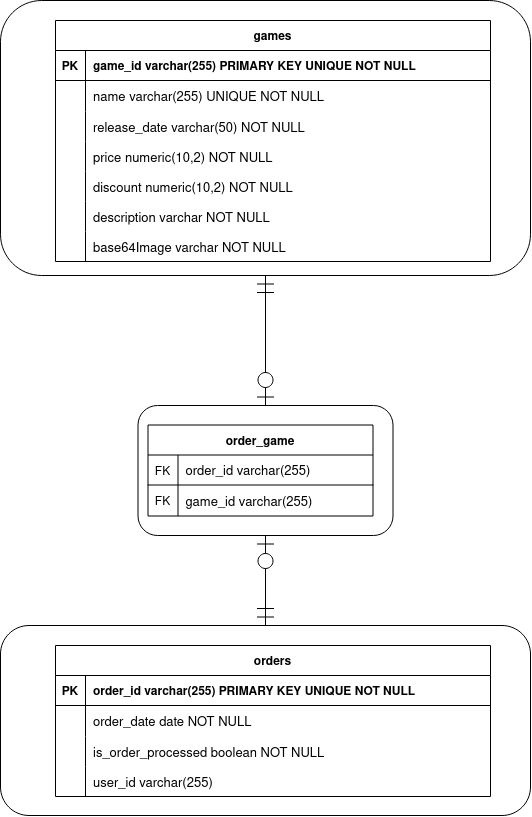

# FND Games Store 

This is a modern web app - Games Store, made as a learning project. This microservice-based
games store is composed of microservices developed with Spring(Java) and using React for the UI.
Feel free to check out our work.

## Preview


## Getting started
These instructions will get you a copy of the project up and run it on your machine.


### Prerequisites
* Stable Docker and Docker Compose versions installed on your machine.

### Installation
Clone repository *(or download it as .zip archive)*
```console
git clone https://github.com/Friendly-neighborhood-development/Fnd_games_store.git
```
* Move to project folder
```console
cd Fnd_games_store
```
* Build and run application with Compose
*(first start can take a lot of time, so please be patient)*
```console
docker compose up
```
* Note that, if your machine has lower than 8Gb RAM, please use script for sequential docker 
images build 
```console
chmod +x low_ram_build.sh 
```
and
```console
./low_ram_build.sh 
```
After build is completed run application with Compose 
```console
docker compose up
```
Now enjoy 🙂

## Frontend stack
* **React** - UI library
* **Tailwind CSS** - CSS framework
* **HeadlessUI** - unstyled, fully accessible UI components
* **Heroicons** - SVG icons
* **Redux (Redux Toolkit)** - state manager
* **Typescript** - JavaScript that scales
* **Axios** - library for HTTP requests
* **Npm** - package manager

## Backend stack
* **Java 8**
* **Spring:** Boot, Data, Web, MVC, Security with Jwt
* **Spring Cloud:** Gateway, Config server, Eureka, OpenFeign
* **Message broker:** Apache Kafka
* **ORM:** Hibernate
* **Caching:** Caffeine
* **Databases**: PostgreSQL, H2, Redis
* **Build automation tool:** Gradle
* **Testing:** Junit5, Mockito
* **Deployment:** Docker, Docker Compose
* **Miscellaneous:** Lombok

## Architecture

## Games service database scheme
<p align="center">
  
</p>

## Login service database scheme
<p align="center">
  
</p>

## Orders service database scheme
<p align="center">
  
</p>

## Features
* Service discovery performed by Netflix Eureka
* Security is built upon Spring Security with Jwt technologies
* Load balancing performed by Spring Cloud Gateway
* Service configuration provided by Spring Cloud Config
* Games avatars stores as base64 strings in databases

## Authors
* Frontend: [Andrew Semenov](https://t.me/keax4208)
* Backend: [Sergey Podgorny](https://t.me/SergeyPodgornyj)

We will be glad to see ur feedback 😉


